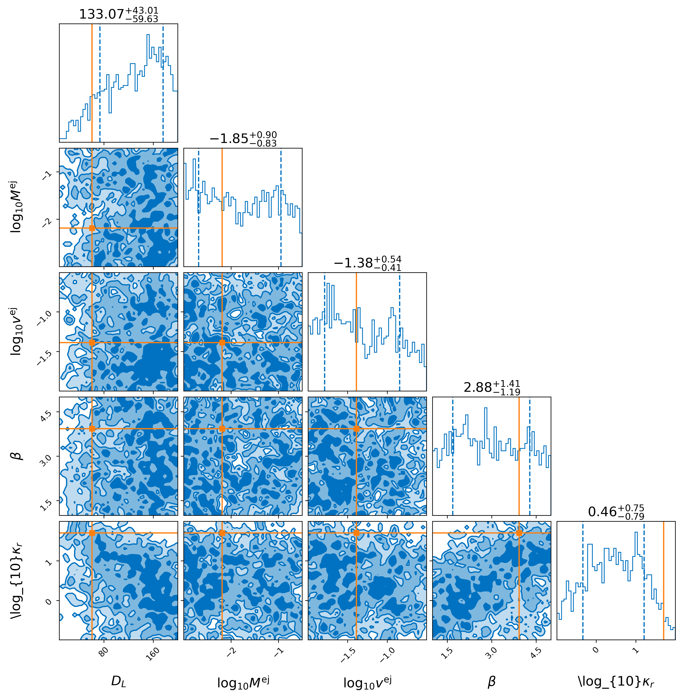
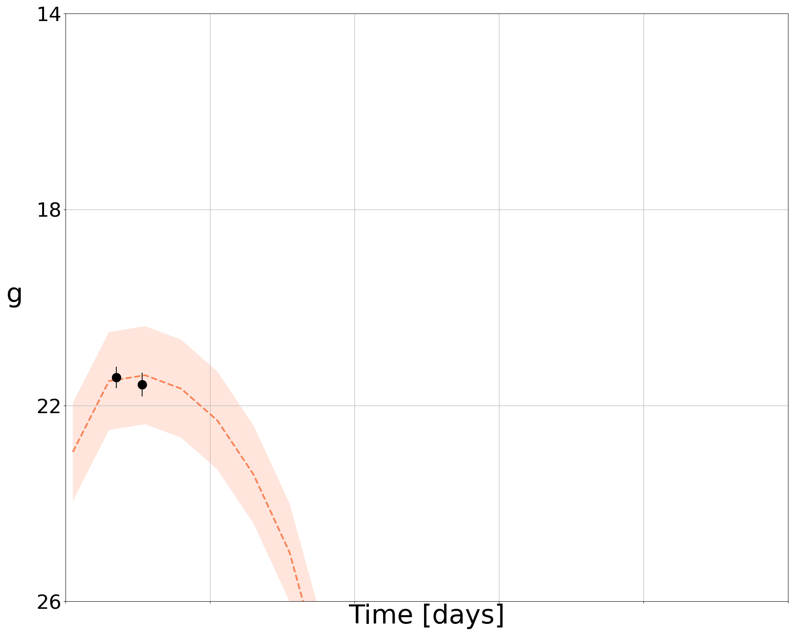

## Light curve fitting

Given a light curve from an optical survey telescope (and potential follow-up), the goal is to analyze the light curve to perform parameter inference. Within NMMA, there are a number of [models](./models.html) available.

### Models

Some are analytic / semi-analytic models that can be sampled, others rely on sampling from a grid of modeled lightcurves through the use of Principle Component Analysis (PCA) and an interpolation scheme (either Gaussian process modeling or neural networks). The PCA serves to represent each light curve by a small number of "eigenvalues", rather than the full lightcurve. After performing PCA, you will have a discrete grid of models that relate merger parameters to a few **lightcurve eigenvalues** rather than the whole lightcurve.

At this point, you can model this grid as either a Gaussian process or Neural Network. This will allow you to form a **continuous map** from merger parameters to lightcurve eigenvalues, which are then converted directly to the set of light curve parameters that most likely resulted in this lightcurve.

In many cases, the lightcurve predicted by each set of parameters is **extremely high-dimensional**, given the number of measurements made. Our goal for this example is to to determine the best-fit model parameters for an object based on its observed lightcurve.

### Example fit to simulated data

Following the quick start, we assume that an injection file has been made generated and made available. For example, there are a number of extra parameters available to modify the light curve sampling, including:

* --ztf-sampling: Uses a gaussian KDE to simulate ZTF pointing set for ZTF-II in g and r, and private/partnernship in i
* --ztf-uncertainties: Simulates magnitude uncertainties using skew normal fits to forced photometry uncertainties in mag_bins=[12,18,20,21,23]
* --ztf-ToO: Adds realistic ToO pointings during the first one or two days (1/2 randomly chosen) for specified exposure times: either 180s (valid for skymaps <1000sq deg) or 300s (skymaps >1000sq deg). Has no effect if --ztf-sampling is not turned on.

We can use these flags as follows:

        light_curve_analysis --model Me2017 --svd-path ./svdmodels --outdir outdir --label injection --prior priors/Me2017.prior --tmin 0.1 --tmax 20 --dt 0.5 --error-budget 1 --nlive 512 --Ebv-max 0 --injection ./injection.json --injection-num 0 --injection-outfile outdir/lc.csv --generation-seed 42 --filters g,r,i --plot --remove-nondetections --ztf-uncertainties --ztf-sampling --ztf-ToO 180

This produces a light curve and parameter inference of the form:

### Analysis of a real object

Of course, analysis of simulated objects are not the ultimate goal for the analysis. However, we can also analyze real light curves. We take as an example one of the files in example_files/candidate_data/ (ZTF21abjvfbc.dat) and run:

	light_curve_analysis --model Bu2019lm --svd-path ./svdmodels --gptype tensorflow --outdir outdir --label injection --prior priors/Bu2019lm.prior --tmin 0.1 --tmax 20 --dt 0.5 --error-budget 1 --nlive 512 --Ebv-max 0 --trigger-time 59397.28347219899 --data example_files/candidate_data/ZTF21abjvfbc.dat --plot

One might note that the --trigger-time is set specifically here in MJD, taken in this example to be the first detection of the object.

This produces a light curve and parameter inference of the form:

