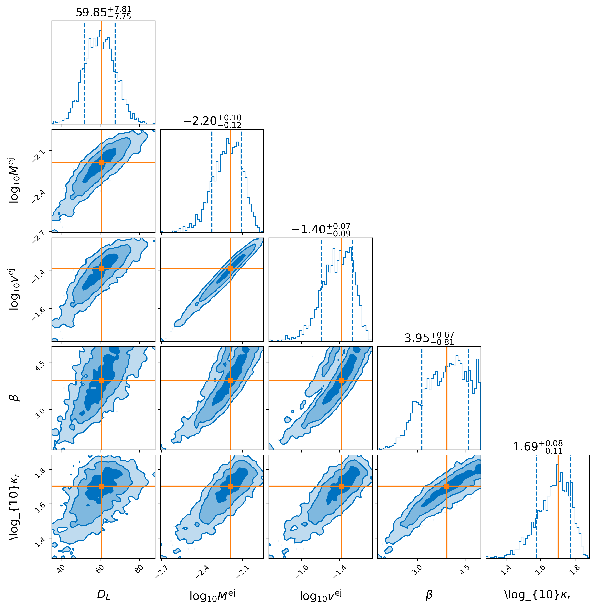
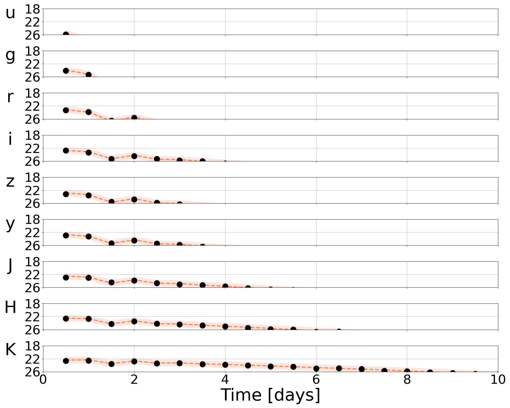

The Nuclear Multimessenger Astronomy (NMMA) framework
-----------------------------------------------------

nmma is a fully featured, Bayesian multi-messenger pipeline targeting
joint analyses of gravitational-wave and electromagnetic data (focusing
on the optical). Using bilby as the back-end, the software is capable of
sampling these data sets using a variety of samplers. It uses chiral
effective field theory based neutron star equation of states when
performing inference, and is also capable of estimating the Hubble Constant.

Quick Start
-----------

nmma provides a number of example models to compare to: kilonovae,
gamma-ray burst afterglows, shock cooling supernovae, core-collapse
supernovae, etc.

We can demonstrate the functionality of the pipeline using a quick example. Taking the Metzger (2017) blue kilonova model as an example, we can generate a set of injections simply using the prior file (all are found in priors/).

.. code-block:: bash

  nmma_create_injection --prior-file priors/Me2017.prior --eos-file example_files/eos/ALF2.dat --binary-type BNS --n-injection 100 --original-parameters --extension json

This generates a file called injection.json that includes an injection file drawn from the prior file with a number of injections specified by --n-injection.

It is this file that is used for the Bayesian inference analysis. An example analysis is as follows:

.. code-block:: bash

  light_curve_analysis --model Me2017 --svd-path ./svdmodels --outdir outdir --label injection --prior priors/Me2017.prior --tmin 0.1 --tmax 20 --dt 0.5 --error-budget 1 --nlive 512 --Ebv-max 0 --injection ./injection.json --injection-num 0 --injection-outfile outdir/lc.csv --generation-seed 42 --filters u,g,r,i,z,y,J,H,K --plot --remove-nondetections

Here, the time array is specified by a minimum, maximum, and delta t (in days) as specified by --tmin, --tmax, and --dt. The particular injection chosen is drawn from an index specified by --injection-num. The --filters available are specified with --filters u,g,r,i,z,y,J,H,K. Summary plots are available in outdir/.

Contributing
------------

nmma is released under the MIT license.  We encourage you to
modify it, reuse it, and contribute changes back for the benefit of
others.  We follow standard open source development practices: changes
are submitted as pull requests and, once they pass the test suite,
reviewed by the team before inclusion.  Please also see
`our contributing guide <./contributing.html>`_.

User Guide
----------

.. toctree::
   :maxdepth: 1

   installation
   fitting
   models
   contributing

.. Indices and tables
.. ==================

.. * :ref:`genindex`
.. * :ref:`modindex`
.. * :ref:`search`
