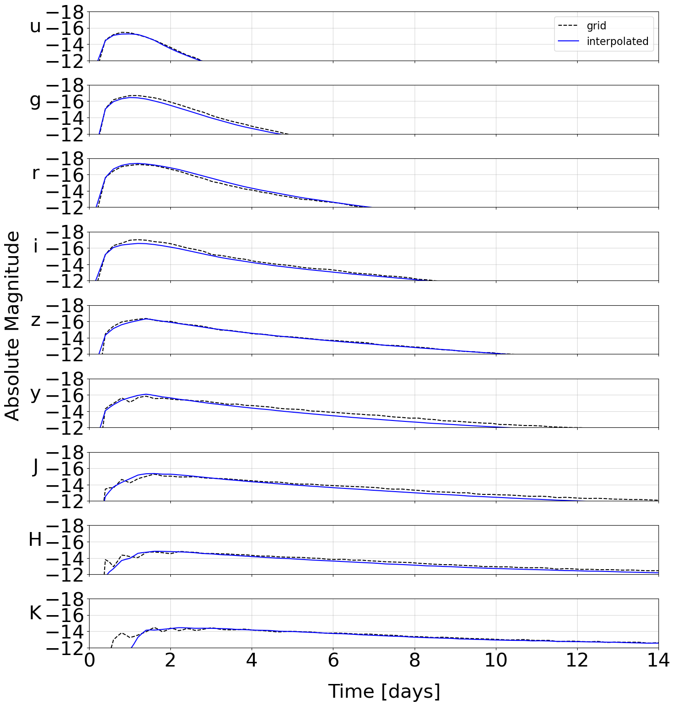

## Training

It is common to have light curves on "grids", for which you have a discrete set of parameters for which the lightcurves were simulated. For example, we may know the lightcurves to expect for specific masses m_1 and m_2, but not for any masses between the two.

We rely on sampling from a grid of modeled lightcurves through the use of Principle Component Analysis (PCA) and an interpolation scheme (either Gaussian process modeling or neural networks). The PCA serves to represent each light curve by a small number of "eigenvalues", rather than the full lightcurve. After performing PCA, you will have a discrete grid of models that relate merger parameters to a few **lightcurve eigenvalues** rather than the whole lightcurve.

At this point, you can model this grid as either a Gaussian process or Neural Network. This will allow you to form a **continuous map** from merger parameters to lightcurve eigenvalues, which are then converted directly to the set of light curve parameters that most likely resulted in this lightcurve.

### NMMA training

There are helper functions within NMMA to support this. In particular, `nmma.em.training.SVDTrainingModel` is designed to take in a grid of models and return an interpolation class.

There are two types of interpolations supported within NMMA currently: scikit-learn's Gaussian Process (sklearn_gp) and tensorflow. In the following, we take tensorflow as our example, but these are interchangable. To start out with, you will need a grid of files in a mildly idiosyncratic format:

	# t[days] sdss::u sdss::g sdss::r sdss::i sdss::z swope2::y swope2::J swope2::H cspk
	0.103 -13.939 -13.680 -13.929 -14.843 -14.631 -14.398 -11.944 -10.784 -3.702
	0.109 -14.373 -14.430 -14.922 -15.113 -15.187 -14.642 -13.457 -11.719 -7.482
	0.116 -14.727 -15.018 -15.670 -15.338 -15.589 -14.870 -14.624 -12.553 -10.453
	0.122 -15.007 -15.459 -16.202 -15.522 -15.858 -15.081 -15.484 -13.288 -12.702
	0.130 -15.222 -15.773 -16.545 -15.669 -16.014 -15.275 -16.079 -13.930 -14.321
	0.137 -15.377 -15.976 -16.729 -15.783 -16.079 -15.449 -16.447 -14.482 -15.397
	0.145 -15.481 -16.086 -16.782 -15.869 -16.072 -15.605 -16.630 -14.947 -16.021
	0.154 -15.540 -16.122 -16.733 -15.931 -16.016 -15.740 -16.667 -15.330 -16.281
	0.163 -15.561 -16.099 -16.610 -15.972 -15.931 -15.853 -16.599 -15.633 -16.268

Typically, the file parameter values are encoded in the file header name. Therefore, we have a helper set of functions defined here: nmma/em/model_parameters.py, one for each model, that translates the filenames into dictionaries with the parameters encoded. For example:

	def Bu2022mv(data):
	    data_out = {}
	    parameters = ["log10_mej_dyn", "vej_dyn", "log10_mej_wind", "vej_wind", "KNtheta"]
	    parameters_idx = [0, 1, 3, 4, 6]
	    magkeys = data.keys()
	    for jj, key in enumerate(magkeys):
	        rr = [np.abs(float(x)) for x in re.findall(r"[-+]?[.]?[\d]+(?:,\d\d\d)*[\.]?\d*(?:[eE][-+]?\d+)?", key)]

		# Best to interpolate mass in log10 space
		rr[0] = np.log10(rr[0])
		rr[3] = np.log10(rr[3])

		data_out[key] = {param:rr[idx] for param,idx in zip(parameters, parameters_idx)}
		data_out[key] = {**data_out[key], **data[key]}
	    return data_out, parameters

A new function will need to be added to nmma/em/model_parameters.py to each model grid that is desired. Once this is done, training can begin:

	create_svdmodel --model Bu2022mv --svd-path svdmodels --interpolation_type tensorflow --tmin 0.0 --tmax 21.0 --dt 0.1 --data-path output/bulla_2Comp_mv --plot --tensorflow-nepochs 100

The output will look something like:

	Training new model
	Normalizing mag filter u...
	Normalizing mag filter g...
	Normalizing mag filter r...
	Normalizing mag filter i...
	Normalizing mag filter z...
	Normalizing mag filter y...
	Normalizing mag filter J...
	Normalizing mag filter H...
	Normalizing mag filter K...
	Computing NN for filter u...

	Epoch 1/50
	61/61 [==============================] - 0s 5ms/step - loss: 2.6934 - val_loss: 0.7583
	Epoch 2/50
	61/61 [==============================] - 0s 943us/step - loss: 0.5029 - val_loss: 0.3023
	Epoch 3/50
	61/61 [==============================] - 0s 896us/step - loss: 0.2313 - val_loss: 0.1542

and so on. The model files are then written to the path given by --svd-path. As a crosscheck, an example interpolated model is plotted over one of the grid points automatically:

This model is then ready to use in an analysis.

	light_curve_analysis --model Bu2022mv --interpolation_type tensorflow --svd-path svdmodels --outdir outdir --label AT2017gfo --trigger-time 57982.5285236896 --data example_files/lightcurves/GW170817.dat --prior priors/Bu2022mv.prior
